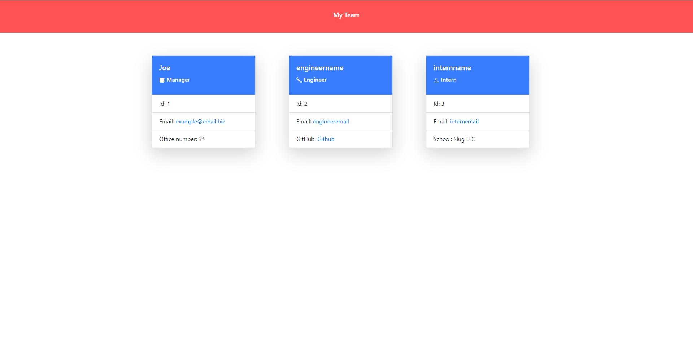

# Daily Planner App

## Overview
 
This app was created to generate a Team profile based on a user's input using the Inquirer module from Node.js and displaying the information on a newly created html page with styling. 

## Usage

The user needs to clone this repository from GitHub and also download Node. This application requires a file system and inquirer module aswell. This application uses Jest.

## Credits

Referenced: The in-class mini challenges from the past week and assistance from a friend of mine.

## License

Refer to the license outlined in this repo.